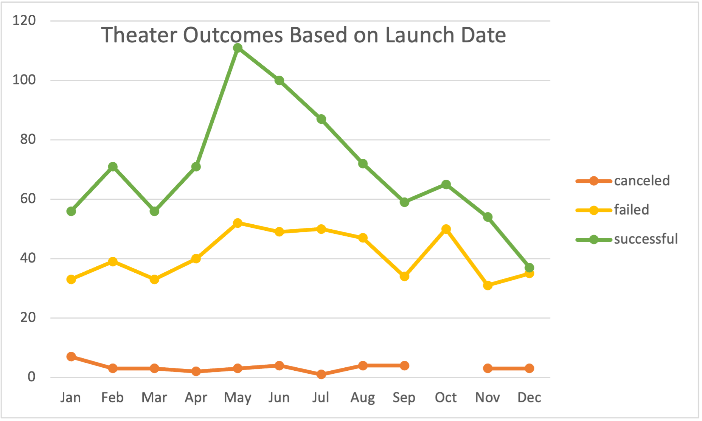
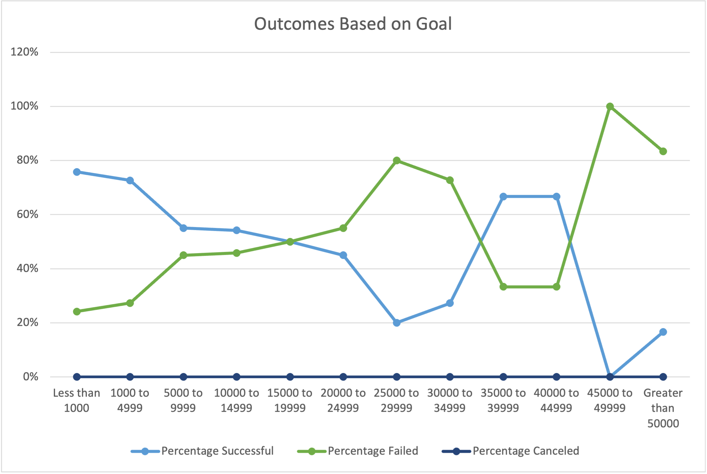

## Analysis and Challenges
### Analysis of Outcomes based on Launch Date

Through filtering the Kickstarter data by category, "theater", launch month, and outcomes, "canceled", "failed", and "successful", into a pivot table and graph we are presented with a visual representation of campaign outcomes.
Based on the data in the table, Mid-Spring is the most popular time to launch a campaign, it is also the time with the most success.
May is the month with the most successful launches with 66% of the campaigns successfully reaching their goals.
As a result of being a month with a high number of launched campaigns, this leads to an expected increase in failed campaigns, as May also saw 52 (or 31%) of campaigns fail. 
Campaigns launched in the fall into early Spring are the least likely to be successful.
October saw 43% of launched campaigns not reaching their goals. 
### Analysis of Outcomes based on Goals

Through filtering the Kickstarter data by category, "theater", campaign goals in monetary ranges, and outcomes, "canceled", "failed", and "successful", into a pivot table and graph we are presented with a visual representation of campaign outcomes in relationships to their fundraising goal.
Campaigns are most likely to be successful if their goal is less than $5,000.
Based on Louise's goal of $10,000 it is truly a toss-up as to whether her campaign would be successful with reaching the goal, as is clearly displayed by the graph.
### Challenges and Difficulties encountered
A challenge encountered with the dataset was the combined group of the category and subcategory.
In order to most effectively navigate the data, these two pieces of data needed to be in separate columns.
Once they were separated it was much easier to find data most helpful to Louise’s campaign.
Limitations of the data are the subjective nature of the opinions of perks offered for kickstarters in relation to the public’s influence on outcomes of campaigns, as well as the limited scope of the data provided.
When considering the perks of a Kickstarter, their appeal is going to have an impact on the campaign’s success (or failure), as opinions about the perks are subjective, it is difficult to consider the factor in an analytical perspective.
With the data provided in the set, it only features campaigns between 2014 and 2016. Kickstarter founded in 2009, leading me to be curious as to whether data outside of 14’-16’ time frame would offer greater insight in predicting the best-case scenario for Louise’s campaign.
## Results
Based on the results of the data analysis, the best time to launch a theater Kickstarter is May or June with a goal of $4,999 or less.
Campaigns launched in September through March are far less likely to be successful; as well as those with goals $5,000 or greater.
The age of this data is a limitation if more recent campaigns present outcomes drastically different from 2014-2016.
Additionally, a graph showing the relationship between campaign length and outcome could show whether keeping a campaign active for longer produces more successful outcomes.
